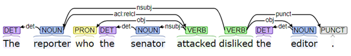
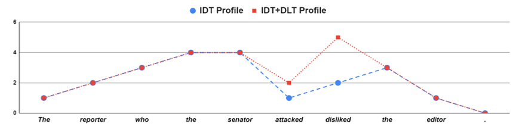

# Syntactic Complexity Metrics for TPR-DB

Compute dependency-based syntactic complexity metrics directly from CRITT TPR-DB data.

This toolkit computes **IDT**, **DLT**, **IDT+DLT**, **NND**, **LE**, and **BCR** from pre-parsed TPR-DB table files (`.st`, `.tt`).

Because the metrics are based on Universal Dependencies (UD) (De Marneffe et al., 2021), the toolkit works on source texts (ST), target texts (TT), and machine translation output (including LLM-generated translations) in any language or language pair supported by UD-compatible parsers such as [Stanza](https://stanfordnlp.github.io/stanza/).

## Metrics

| Metric | Level | Description |
|--------|-------|-------------|
| **IDT** | Token | Incomplete Dependency Theory|
| **DLT** | Token | Dependency Locality Theory|
| **IDT+DLT** | Token | Combined IDT and DLT|
| **NND** | Segment | Nested Noun Distance|
| **LE** | Segment | Left-Embeddedness|
| **BCR** | Segment | Bilingual Complexity Ratio|

## Metric Definitions

All segments (pre-tokenized in TPR-DB) are parsed into dependency trees under Universal Dependencies (UD) (De Marneffe et al., 2021) using Stanford Stanza (Qi et al., 2020). To illustrate the metric computation, we use the object-extracted relative clause in Example (1), whose dependency structure is shown in Figure 1.

**Example (1):** *The reporter who the senator attacked disliked the editor.*

<p align="center">
  <br>
  <em>Figure 1. Dependency parse tree for Example (1)</em>
</p>

```text
 ID      Token       UPOS   Head   Deprel
  1        The        DET      2   det
  2   reporter       NOUN      7   nsubj
  3        who       PRON      6   obj
  4        the        DET      5   det
  5    senator       NOUN      6   nsubj
  6   attacked       VERB      2   acl:relcl
  7   disliked       VERB      0   root
  8        the        DET      9   det
  9     editor       NOUN      7   obj
 10          .      PUNCT      7   punct
```

### IDT (Incomplete Dependency Theory)

The IDT metric quantifies storage cost by counting unresolved dependencies spanning a token position (Gibson, 1998, 2000). Formally, for any token *t*, IDT(*t*) equals the count of syntactic dependencies spanning *t* where one element has been processed (left of *t*) while the other awaits (right of *t*).

In Example (1), at "senator," four dependencies remain incomplete: "reporter" awaits main verb "disliked," the relative clause link to "reporter" remains open, "who" predicts a transitive verb, and "senator" predicts embedded verb "attacked," yielding **IDT(senator) = 4**.

### DLT (Dependency Locality Theory)

The DLT metric measures integration cost by counting discourse referents — operationalized as nouns, proper nouns, and verbs — intervening between syntactic head and dependent (Gibson, 2000). For head token *h*, DLT(*h*) equals the count of discourse referents between *h* and its farthest preceding dependent *d*, including *d* but excluding *h*. Non-heads receive DLT = 0.

In Example (1), "disliked" heads subject "reporter" via nsubj, with intervening discourse referents reporter (N), senator (N), and attacked (V), thus **DLT(disliked) = 3**.

### IDT+DLT (Combined)

Gibson (2000) posits that total processing cost aggregates both storage and integration demands. We therefore define a composite IDT+DLT metric as their sum for each token. For "disliked" in Example (1), IDT = 2 and DLT = 3, yielding **IDT+DLT = 5**.

### LE (Left-Embeddedness)

LE measures pre-verbal memory load by counting all non-auxiliary tokens left of the main verb root, indexing the burden of holding subjects and modifiers prior to predicate resolution (Zou, 2024). In Example (1), tokens before "disliked" — The, reporter, who, the, senator — yield **LE = 5**.

### NND (Nested Noun Distance)

NND quantifies linear distance between hierarchically related nouns, indexing restructuring pressure from English post-nominal modification that must be pre-nominalized in Chinese (Zou, 2024). A noun *n_i* is nested in noun *n_j* if *n_j* appears as an ancestor in the dependency parse tree, with distance calculated as the absolute positional difference |*i*−*j*|.

In Example (1), reporter (position 2), senator (position 5), and editor (position 9) are identified as nouns. Since reporter heads the relative clause containing senator, senator is nested within the "reporter" noun phrase, yielding **NND = |5−2| = 3**.

### BCR (Bilingual Complexity Ratio)

To quantify the degree of syntactic transformation between ST and TT, we calculate BCR for each source-target segment pair:

> **Metric_BCR = Metric_TT / Metric_ST**

A BCR of 1.0 indicates that the translation maintains the same syntactic complexity as the source; a value > 1.0 indicates increased complexity (explicitation/complication), and a value < 1.0 indicates simplification.

### Full per-token output for Example (1)

```
 ID      Token   IDT   DLT  IDT+DLT
  1        The     1     0        1
  2   reporter     2     0        2
  3        who     3     0        3
  4        the     4     0        4
  5    senator     4     0        4
  6   attacked     1     1        2
  7   disliked     2     3        5
  8        the     3     0        3
  9     editor     1     0        1
 10          .     0     0        0

IDT_SUM=21   DLT_SUM=4   IDT+DLT_SUM=25   NND=3   LE=5
```

<p align="center">
  <br>
  <em>Figure 2. IDT and IDT+DLT profiles for Example (1)</em>
</p>

> **Note:** IDT peaks at "the" and "senator" (IDT=4), reflecting maximum storage cost. IDT+DLT peaks at "disliked" (IDT+DLT=5), where combined storage and integration cost is highest.

### Aggregation

While IDT, DLT, and IDT+DLT are token-level metrics, LE and NND are segment-level metrics. Assessing translation quality requires segment-level granularity. We aggregate token-wise values using statistical functions: **sum**, **mean**, or **max**. Based on correlation analysis, the sum aggregation function showed the strongest correlations and is selected as the default.

## Requirements

- Python 3.8+
- `pandas`
- Works with pre-parsed dependency annotations already in TPR-DB data

## Scripts

### `table_complexity.py` — Compute from TPR-DB tables

The primary script. Reads `.st` (source token) and `.tt` (target token) table files with pre-parsed `upos`, `head`, `deprel` columns.

**Command line:**

```bash
python table_complexity.py P01_T1.st                        # ST only
python table_complexity.py P01_T1.st P01_T1.tt              # ST + TT + BCR
python table_complexity.py P01_T1.st P01_T1.tt -a mean      # mean aggregation
python table_complexity.py P01_T1.st P01_T1.tt -a max       # max aggregation
python table_complexity.py P01_T1.st -f token               # per-token output
python table_complexity.py P01_T1.st P01_T1.tt -o results.csv  # CSV export
```

**Python API:**

```python
from table_complexity import process_table, print_segment_results, print_token_results

# Segment-level (default: sum aggregation)
token_results, seg_results = process_table('P01_T1.st', 'P01_T1.tt')
print_segment_results(seg_results)

# Per-token IDT, DLT, IDT+DLT
print_token_results(token_results)

# Mean aggregation
token_results, seg_results = process_table('P01_T1.st', 'P01_T1.tt', aggregation='mean')
print_segment_results(seg_results, aggregation='mean')

# Max aggregation
token_results, seg_results = process_table('P01_T1.st', 'P01_T1.tt', aggregation='max')
print_segment_results(seg_results, aggregation='max')
```

**Required table columns:** `SToken`/`TToken`, `STid`/`TTid`, `STseg`/`TTseg`, `upos`, `head`, `deprel`

### `test_complexity.py` — Test on individual sentences

Verify metrics on a single sentence, with step-by-step traces showing exactly which arcs cross each token.

**Pre-parsed mode (no dependencies):**

```bash
python test_complexity.py --parsed "The/DET/2/det reporter/NOUN/7/nsubj who/PRON/6/obj the/DET/5/det senator/NOUN/6/nsubj attacked/VERB/2/acl:relcl disliked/VERB/0/root the/DET/9/det editor/NOUN/7/obj ./PUNCT/7/punct"
```

Format: `token/UPOS/head/deprel` separated by spaces. Head is 1-based (0 = root).

**Example output** for Example (1):

```bash
python test_complexity.py --parsed "The/DET/2/det reporter/NOUN/7/nsubj who/PRON/6/obj the/DET/5/det senator/NOUN/6/nsubj attacked/VERB/2/acl:relcl disliked/VERB/0/root the/DET/9/det editor/NOUN/7/obj ./PUNCT/7/punct"
```

```
--- IDT (arc crossings) ---
   1          The  IDT=1   reporter(2)->The(1)
   2     reporter  IDT=2   disliked(7)->reporter(2), reporter(2)->attacked(6)
   3          who  IDT=3   disliked(7)->reporter(2), attacked(6)->who(3), reporter(2)->attacked(6)
   4          the  IDT=4   disliked(7)->reporter(2), attacked(6)->who(3), senator(5)->the(4), reporter(2)->attacked(6)
   5      senator  IDT=4   disliked(7)->reporter(2), attacked(6)->who(3), attacked(6)->senator(5), reporter(2)->attacked(6)
   6     attacked  IDT=1   disliked(7)->reporter(2)
   7     disliked  IDT=2   disliked(7)->editor(9), disliked(7)->.(10)
   8          the  IDT=3   editor(9)->the(8), disliked(7)->editor(9), disliked(7)->.(10)
   9       editor  IDT=1   disliked(7)->.(10)
  10            .  IDT=0   -

--- DLT (discourse referents on longest backward link) ---
  attacked(6) -> who(3): referents=['senator(NOUN)'] DLT=1
  disliked(7) -> reporter(2): referents=['attacked(VERB)', 'senator(NOUN)', 'reporter(NOUN)'] DLT=3

--- NND (noun pair ancestor distance) ---
  Nouns: [(2, 'reporter'), (5, 'senator'), (9, 'editor')]
  (reporter, senator): reporter is ancestor of senator, NND=3
  (senator, editor): no ancestor relation, NND=0

--- LE (pre-verbal memory load) ---
  Verbs: ['attacked', 'disliked']
  Pattern: X X X X X V V X X X
  Gaps: [5, 0]
  LE=5

Metric          SUM     MEAN    MAX
-----------------------------------
IDT              21     2.10      4
DLT               4     0.40      3
IDT+DLT          25     2.50      5
NND               3     1.50      3
LE                5     2.50      5
```

## References

- De Marneffe, M.-C., Manning, C. D., Nivre, J., & Zeman, D. (2021). Universal Dependencies. *Computational Linguistics*, 47(2), 255–308.
- Gibson, E. (1998). Linguistic complexity: Locality of syntactic dependencies. *Cognition*, 68(1), 1–76.
- Gibson, E. (2000). The dependency locality theory: A distance-based theory of linguistic complexity. *Image, Language, Brain*, 95–126.
- Qi, P., Zhang, Y., Zhang, Y., Bolton, J., & Manning, C. D. (2020). Stanza: A Python natural language processing toolkit for many human languages. In *Proceedings of the 58th annual meeting of the association for computational linguistics: system demonstrations*, 101-108.
- Zou, L. (2024). Cognitive processes in human-ChatGPT interaction during machine translation post-editing. PhD Thesis, Kent State University.

## Citation

If you use this tool in your research, please cite:

```bibtex
@inproceedings{zou2022ai,
  title={AI-Based Syntactic Complexity Metrics and Sight Interpreting Performance},
  author={Zou, Longhui and Carl, Michael and Mirzapour, Mehdi and Jacquenet, H{\'e}l{\`e}ne and Vieira, Lucas Nunes},
  booktitle={Intelligent Human Computer Interaction (LNCS 13184)},
  year={2022},
  publisher={Springer}
}

@phdthesis{zou2024cognitive,
  title={Cognitive Processes in Human-ChatGPT Interaction during Machine Translation Post-Editing},
  author={Zou, Longhui},
  year={2024},
  school={Kent State University}
}

@inproceedings{zou2024impact,
  title={Impact of Syntactic Complexity on the Processes and Performance of Large Language Models-Leveraged Post-Editing},
  author={Zou, Longhui and Carl, Michael and Momtaz, Shaghayegh and Mirzapour, Mehdi},
  booktitle={Proceedings of the 16th Conference of the Association for Machine Translation in the Americas (Volume 2: Presentations)},
  pages={259--260},
  year={2024}
}

@article{zou2025complexity,
  title={How dependency-based syntactic complexity shapes post-editing of LLM-generated translations: Global and diagnostic evidence},
  author={Zou, Longhui and Carl, Michael and Feng, Jia},
  journal={Translation, Cognition \& Behavior},
  year={2025},
  doi={10.1075/tcb.00100.zou}
}

@inproceedings{zou2025genaiese,
  title={GenAIese--A Comprehensive Comparison of GPT-4o and DeepSeek-V3 for English-to-Chinese Academic Translation},
  author={Zou, Longhui and Li, Ke and Lamerton, Joshua and Mirzapour, Mehdi},
  booktitle={Proceedings of the Eleventh Workshop on Patent and Scientific Literature Translation (PSLT 2025)},
  pages={1--12},
  year={2025}
}
```


